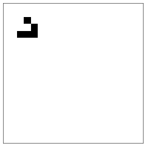

# rustlife

A small Python library for Conway's Game of Life with a Rust backend, written as a project to learn how to build Python extensions in Rust with [PyO3](https://pyo3.rs/v0.28.3/getting-started) and [maturin](https://www.maturin.rs).



See [`examples/animate.py`](examples/animate.py) for a live matplotlib animation.

```python
from rustlife import Life

life = Life(5, 5)
for col in (1, 2, 3):
    life.set(2, col, True)

life.step()
print(life)
```

```
.....
..#..
..#..
..#..
.....
```

## Running It

```bash
cargo test                          # rust tests
uv run pytest                       # python tests
uv run python examples/animate.py   # matplotlib animation
```

## How It Works

### The Code

| File | Description |
|---|---|
| `src/grid.rs` | The Game of Life in plain Rust. |
| `src/lib.rs` | The Python wrapper, using PyO3 to expose `Grid` as the Python class `Life`. |
| `src/rustlife/_core.abi3.so` | The extension module (not commited), a shared library compiled from the Rust and imported by Python. |
| `src/rustlife/__init__.py` | The Python package which simply re-exports `Life`. |
| `src/rustlife/_core.pyi` | The type stub, with type hints for editors and type checkers. |

### The Build

`pyproject.toml` names maturin as the build backend and lists Rust files under `cache-keys`. So on `uv run`, if a Rust file has changed, maturin runs cargo to compile the Rust code, then copies it from `target/release/` to `src/rustlife/_core.abi3.so`, where Python imports it.